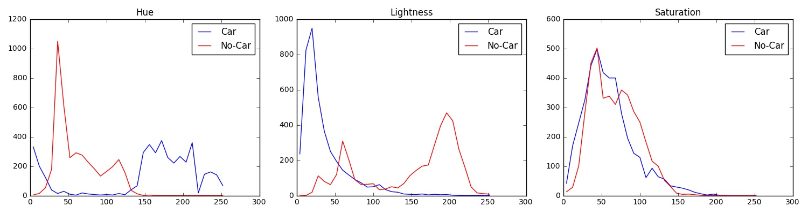
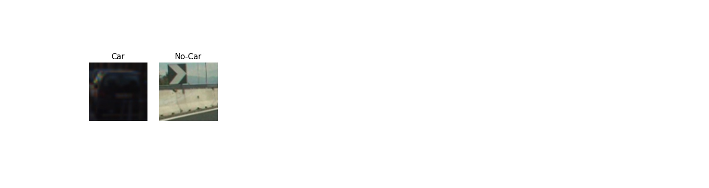

# Vehicle Detection Project - Writeup
[](http://www.udacity.com/drive)

Aim
---

The aim of this project is to detect vehicles positions in a video stream.

In order to do this, I used a mixed technique which combines together Computer Vision and
Machine Learning.

  * Computer Vision Technique: **Histogram of Oriented Gradients (HOG)**
  * Machine Learning Technique: **Linear Support Vector Classifier (SVM)**

Below are reported the main steps I followed in order to detect the vehicles positions in the video stream.

  1. Gather a training dataset which contains labelled images of cars and non-cars.
  1. Train a Linear Support Vector Classifier on the dataset.
  1. Extract a set of squared sub-images from the frames of the video.
  1. Run the Linear Classifier on the sub-images extracted from the frames of the video.
  1. Apply a *heat-map* technique to reduce the detection of false positives.

Dataset Exploration
---

The dataset used for the purpose of this project is the combination of the
[GTI vehicle image database](http://www.gti.ssr.upm.es/data/Vehicle_database.html),
the [KITTI vision benchmark suite](http://www.cvlibs.net/datasets/kitti/), and examples
extracted from the project video itself.

The dataset contains two sets of images: **Cars** and **No-Cars**. Each image has 3-color channels
and sizes 64x64 pixels. The entire dataset counts 17760 samples divided as follows.


The picture below depicts some samples labelled as images of **Cars**.


The picture below depicts some samples labelled as images of **No-Cars**.


Histogram of Oriented Gradients (HOG)
---

***Explain how (and identify where in your code) you extracted HOG features from the training images. Explain how you settled on your final choice of HOG parameters.***

In order to extract the HOG features from the training images I leveraged on the OpenCV `hog()` function.
The `hog()` function does pretty much everything on its own.

However, some parameter of the `hog()` function must be set in order to achieve a reasonable result.

Below is reported the snipped of code that extract the HOG feature from a single color channel image.

```python
def compute_hog(img, pix_per_cell=8, cell_per_block=2, orient=12, vis=False, feature_vec=True):
    if vis == True:
        features, hog_img = hog(img,
                                orientations=orient,
                                pixels_per_cell=(pix_per_cell, pix_per_cell),
                                cells_per_block=(cell_per_block, cell_per_block),
                                transform_sqrt=False,
                                visualise=True,
                                feature_vector=False)
        return features, hog_img
    else:
        features = hog(img,
                       orientations=orient,
                       pixels_per_cell=(pix_per_cell, pix_per_cell),
                       cells_per_block=(cell_per_block, cell_per_block),
                       transform_sqrt=False,
                       visualise=False,
                       feature_vector=feature_vec)
        return features
```

As can be seen, I set the function parameters to be those reported below.

| Parameter        | Value |
|------------------|-------|
| `pix_per_cell`   | 8     |
| `cell_per_block` | 2     |
| `orientations`   | 12    |

It is worth noting that high values of number of `orientations` (i.e. 12) lead to better HOG fetures.

In order to choose the values reported above I run a few tests which displayed the HOG histograms.
In particular I firstly choose the color space which gave me the best difference of feature values when comparing Cars and No-Cars images. Secondly, I displayed the Car and No-Car HOG histograms, one per each
color channel.

Here below are depicted a set of plots whose aim is to visualize the color features of Car and No-Car images. The information gathered from the plots below was used to choose the best color space to use
for computing the HOG features.

### RGB Color Space Analysis

Below are depicted three plots. Each plot represents the distribution of the pixel intensity of a single channel (Red, Green, Blue). Data was sampled using 32 bins.

Blue lines represent Car images and red lines represent No-Car images.


### HSV Color Space Analysis

Below are depicted three plots. Each plot represents the distribution of the pixel intensity of a single channel (Hue, Saturation, Value). Data was sampled using 32 bins.

Blue lines represent Car images and red lines represent No-Car images.


### HLS Color Space Analysis

Below are depicted three plots. Each plot represents the distribution of the pixel intensity of a single channel (Hue, Lightness, Saturation). Data was sampled using 32 bins.

Blue lines represent Car images and red lines represent No-Car images.



From the plots above, it is easy to notice that the **HSV** color space leads to a better features separation between Car and No-Car images therefore, I decided to rely on this color space to compute the HOG features.

### HSV HOG Analysis

Given the following images



I computed the HOG in the HSV color space and that lead to these results.

### Hue Channel


### Saturation Channel


### Value Channel


As can be seen the **Saturation** and **Value** channels better identify the edges of a car therefore,
I decided to train my classifier using the following features:

  * Histogram of Gradients in the **Saturation** Channel
  * Histogram of Gradients in the **Value** Channel

***Describe how (and identify where in your code) you trained a classifier using your selected HOG features (and color features if you used them).***

The snipped below (extracted from the Notebook) trains a Linear SVM classifier.

```python
# Use a linear SVC
svc = LinearSVC(C=10e6)

# Check the training time for the SVC
t0=time.time()
svc.fit(X_train, y_train)
t1 = time.time()
```

I tweeked a bit the `C` hyperparameter of the SVM to obtain I higher margin between the two classes.
However, it is worth pointing out how I built up the features vector (`X_train`).

The features vector is simply the concatenation of the Histogram of Gradients in the **Saturation** Channel and the Histogram of Gradients in the **Value** Channel.

```python
hog_features = np.concatenate((ch2_hog_hist, ch3_hog_hist))
```

The result of the concatenation is then normalized using a `StandardScaler()` object.

The reason behind the normalization is the following:

*A normalized dataset leads to better result because it avoids one feature to dominate over another feature*.

The picture below depicts the features vector.


With the hyperparameters above, my classifier reached an **accuracy of 97%** on the test set (20% of the entire dataset).

Sliding Window Search
---

***Describe how (and identify where in your code) you implemented a sliding window search. How did you decide what scales to search and how much to overlap windows?***

The snippet below was used in the notebook to extract a set of windows from each frame of the videoclip.

```python
def slide_window(img, x_start_stop=[None, None], y_start_stop=[None, None],
                     xy_window=(64, 64), xy_overlap=(0.5, 0.5)):
    # If x and/or y start/stop positions not defined, set to image size
    if x_start_stop[0] == None:
        x_start_stop[0] = 0
    if x_start_stop[1] == None:
        x_start_stop[1] = img.shape[1]
    if y_start_stop[0] == None:
        y_start_stop[0] = 0
    if y_start_stop[1] == None:
        y_start_stop[1] = img.shape[0]

    # Compute the span of the region to be searched
    xspan = x_start_stop[1] - x_start_stop[0]
    yspan = y_start_stop[1] - y_start_stop[0]

    # Compute the number of pixels per step in x/y
    nx_pix_per_step = np.int(xy_window[0]*(1 - xy_overlap[0]))
    ny_pix_per_step = np.int(xy_window[1]*(1 - xy_overlap[1]))

    # Compute the number of windows in x/y
    nx_windows = np.int(xspan/nx_pix_per_step) - 1
    ny_windows = np.int(yspan/ny_pix_per_step) - 1

    # Initialize a list to append window positions to
    window_list = []

    # Loop through finding x and y window positions
    # Note: you could vectorize this step, but in practice
    # you'll be considering windows one by one with your
    # classifier, so looping makes sense
    for ys in range(ny_windows):
        for xs in range(nx_windows):
            # Calculate window position
            startx = xs*nx_pix_per_step + x_start_stop[0]
            endx = startx + xy_window[0]
            starty = ys*ny_pix_per_step + y_start_stop[0]
            endy = starty + xy_window[1]
            # Append window position to list
            window_list.append(((startx, starty), (endx, endy)))

    # Return the list of windows
    return window_list
```

It is worth noting that the function `slide_window` performs a rough search which spans across the entire `x_start_stop` and `y_start_stop` square.

However, in the Notebook, the function is called three times with three different window sizes and three different overlap values.

| #Call        | Window Size | Overlap |
|--------------|-------------|---------|
| #1           | 80x80       | 80%     |
| #2           | 96x96       | 70%     |
| #3           | 128x128     | 70%     |

The output of the `slide_window` calls is reported below.


I would like to point out that no optimizations in the window search has been done at this stage of development.

***Show some examples of test images to demonstrate how your pipeline is working. How did you optimize the performance of your classifier?***

By changing the size of the windows I was able to increase the number of correct classified images.

Here below are reported six different outputs of my pipeline.


Video Implementation
---

***Provide a link to your final video output. Your pipeline should perform reasonably well on the entire project video (somewhat wobbly or unstable bounding boxes are ok as long as you are identifying the vehicles most of the time with minimal false positives.)***

***Describe how (and identify where in your code) you implemented some kind of filter for false positives and some method for combining overlapping bounding boxes.***

[Link To Video](https://youtu.be/5OZsDznUVvA)

The introduction of a heatmap to idenfiy the car positions was the most important choiche in reducing the the number of false positives.

Going a bit in detail, for each frame of the video:

  1. I extracted a set of windows
  1. I classified the images inside the windows
  1. I created a heatmap of the position of the car
  1. I drawn the boxes around the cars

Discussion
---

***Briefly discuss any problems / issues you faced in your implementation of this project. Where will your pipeline likely fail? What could you do to make it more robust?***

The most relevant issue I faced in this project was figuring the correct windows size to let my classifier perform reasonably well. I ended up by playing around with values that go from 64x64 up to 128x128 but I figured that the best lower bound was 80x80.

Another important hyperparameter to train was the windows overlap. High values of overlap (80%-90%) produce a lot of windows and, at the same time allow to better identify the car position. On the contrary, low values of overlap (20%-30%) generate only a few windows making harder for the classifier to correcly identify the car position.

One drawback of my classifier is the image saturation. In other words, really brigth images or really dark images will likely fail to be classified correctly. In order to avoid such a behaviour I think to normalize the histogram of an image before feed it into the classifier.

Another improvement would be training my classifier using another set of features either by using 2 HOG color spaces or the color features themself.

To conclude, I would really like to traing a CNN to use as classifier instead of using the SVM.

*Stefano*