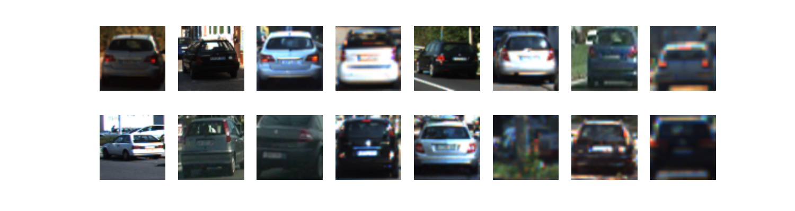
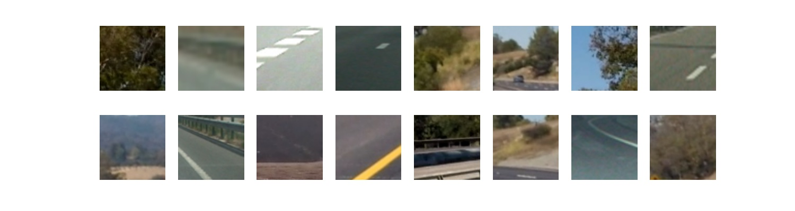
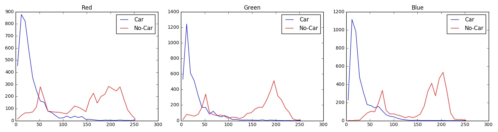
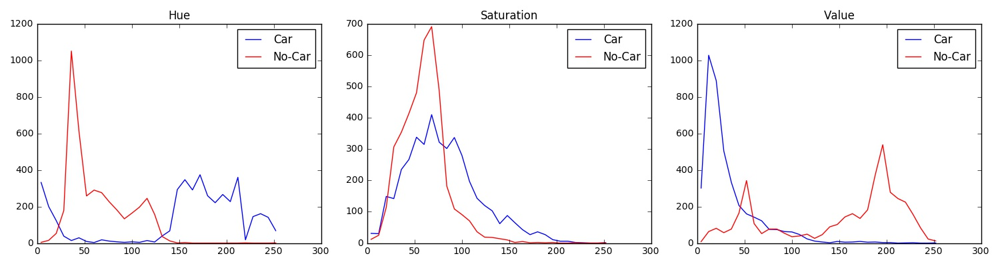
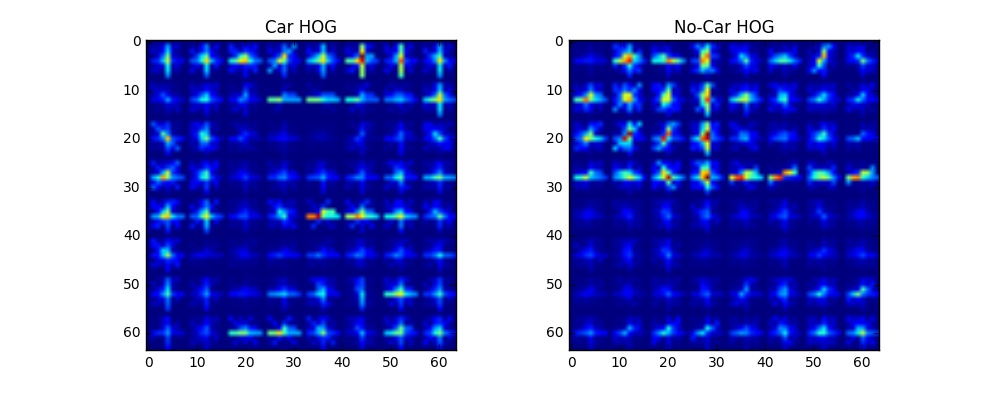
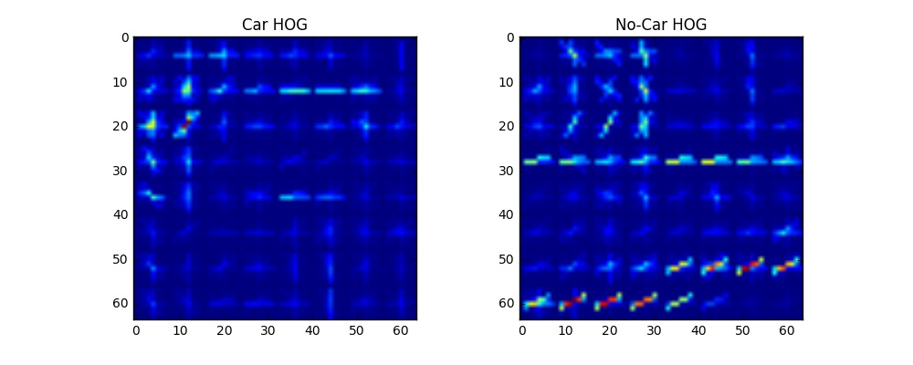
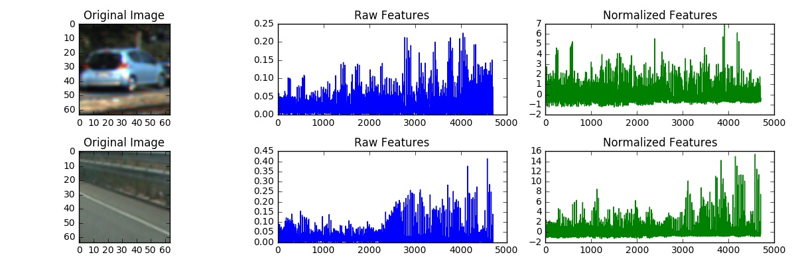

# Vehicle Detection Project - Writeup
[](http://www.udacity.com/drive)

Aim
---

The aim of this project is to detect vehicles positions in a video stream.

In order to do this, I used a mixed technique which combines together Computer Vision and
Machine Learning.

  * Computer Vision Technique: **Histogram of Oriented Gradients (HOG)**
  * Machine Learning Technique: **Linear Support Vector Classifier (SVM)**

Below are reported the main steps I followed in order to detect the vehicles positions in the video stream.

  1. Gather a training dataset which contains labelled images of cars and non-cars.
  1. Train a Linear Support Vector Classifier on the dataset.
  1. Extract a set of squared sub-images from the frames of the video.
  1. Run the Linear Classifier on the sub-images extracted from the frames of the video.
  1. Apply a *heat-map* technique to reduce the detection of false positives.

Dataset Exploration
---

The dataset used for the purpose of this project is the combination of the
[GTI vehicle image database](http://www.gti.ssr.upm.es/data/Vehicle_database.html),
the [KITTI vision benchmark suite](http://www.cvlibs.net/datasets/kitti/), and examples
extracted from the project video itself.

The dataset contains two sets of images: **Cars** and **No-Cars**. Each image has 3-color channels
and sizes 64x64 pixels. The entire dataset counts 17760 samples divided as follows.


The picture below depicts some samples labelled as images of **Cars**.



The picture below depicts some samples labelled as images of **No-Cars**.



Histogram of Oriented Gradients (HOG)
---

***Explain how (and identify where in your code) you extracted HOG features from the training images. Explain how you settled on your final choice of HOG parameters.***

In order to extract the HOG features from the training images I leveraged on the OpenCV `hog()` function.
The `hog()` function does pretty much everything on its own.

However, some parameter of the `hog()` function must be set in order to achieve a reasonable result.

Below is reported the snipped of code that extract the HOG feature from a single color channel image.

```python
def compute_hog(img, pix_per_cell=8, cell_per_block=2, orient=12, vis=False, feature_vec=True):
    if vis == True:
        features, hog_img = hog(img,
                                orientations=orient,
                                pixels_per_cell=(pix_per_cell, pix_per_cell),
                                cells_per_block=(cell_per_block, cell_per_block),
                                transform_sqrt=False,
                                visualise=True,
                                feature_vector=False)
        return features, hog_img
    else:
        features = hog(img,
                       orientations=orient,
                       pixels_per_cell=(pix_per_cell, pix_per_cell),
                       cells_per_block=(cell_per_block, cell_per_block),
                       transform_sqrt=False,
                       visualise=False,
                       feature_vector=feature_vec)
        return features
```

As can be seen, I set the function parameters to be those reported below.

| Parameter        | Value |
|------------------|-------|
| `pix_per_cell`   | 8     |
| `cell_per_block` | 2     |
| `orientations`   | 12    |

It is worth noting that high values of number of `orientations` (i.e. 12) lead to better HOG fetures.

In order to choose the values reported above I run a few tests which displayed the HOG histograms.
In particular I firstly choose the color space which gave me the best difference of feature values when comparing Cars and No-Cars images. Secondly, I displayed the Car and No-Car HOG histograms, one per each
color channel.

Here below are depicted a set of plots whose aim is to visualize the color features of Car and No-Car images. The information gathered from the plots below was used to choose the best color space to use
for computing the HOG features.

### RGB Color Space Analysis

Below are depicted three plots. Each plot represents the distribution of the pixel intensity of a single channel (Red, Green, Blue). Data was sampled using 32 bins.

Blue lines represent Car images and red lines represent No-Car images.



### HSV Color Space Analysis

Below are depicted three plots. Each plot represents the distribution of the pixel intensity of a single channel (Hue, Saturation, Value). Data was sampled using 32 bins.

Blue lines represent Car images and red lines represent No-Car images.



### HLS Color Space Analysis

Below are depicted three plots. Each plot represents the distribution of the pixel intensity of a single channel (Hue, Lightness, Saturation). Data was sampled using 32 bins.

Blue lines represent Car images and red lines represent No-Car images.


From the plots above, it is easy to notice that the **HSV** color space leads to a better features separation between Car and No-Car images therefore, I decided to rely on this color space to compute the HOG features.

### HSV HOG Analysis

Given the following images


I computed the HOG in the HSV color space and that lead to these results.

### Hue Channel



### Saturation Channel


### Value Channel



As can be seen the **Saturation** and **Value** channels better identify the edges of a car therefore,
I decided to train my classifier using the following features:

  * Histogram of Gradients in the **Saturation** Channel
  * Histogram of Gradients in the **Value** Channel

***Describe how (and identify where in your code) you trained a classifier using your selected HOG features (and color features if you used them).***

The snipped below (extracted from the Notebook) trains a Linear SVM classifier.

```python
# Use a linear SVC
svc = LinearSVC(C=10e6)

# Check the training time for the SVC
t0=time.time()
svc.fit(X_train, y_train)
t1 = time.time()
```

I tweeked a bit the `C` hyperparameter of the SVM to obtain I higher margin between the two classes.
However, it is worth pointing out how I built up the features vector (`X_train`).

The features vector is simply the concatenation of the Histogram of Gradients in the **Saturation** Channel and the Histogram of Gradients in the **Value** Channel.

```python
hog_features = np.concatenate((ch2_hog_hist, ch3_hog_hist))
```

The result of the concatenation is then normalized using a `StandardScaler()` object.

The reason behind the normalization is the following:

*A normalized dataset leads to better result because it avoids one feature to dominate over another feature*.

The picture below depicts the features vector.



With the hyperparameters above, my classifier reached an **accuracy of 97%** on the test set (20% of the entire dataset).

Sliding Window Search
---

***Describe how (and identify where in your code) you implemented a sliding window search. How did you decide what scales to search and how much to overlap windows?***

***Show some examples of test images to demonstrate how your pipeline is working. How did you optimize the performance of your classifier?***

Video Implementation
---

***Provide a link to your final video output. Your pipeline should perform reasonably well on the entire project video (somewhat wobbly or unstable bounding boxes are ok as long as you are identifying the vehicles most of the time with minimal false positives.)***

***Describe how (and identify where in your code) you implemented some kind of filter for false positives and some method for combining overlapping bounding boxes.***

Discussion
---

***Briefly discuss any problems / issues you faced in your implementation of this project. Where will your pipeline likely fail? What could you do to make it more robust?***